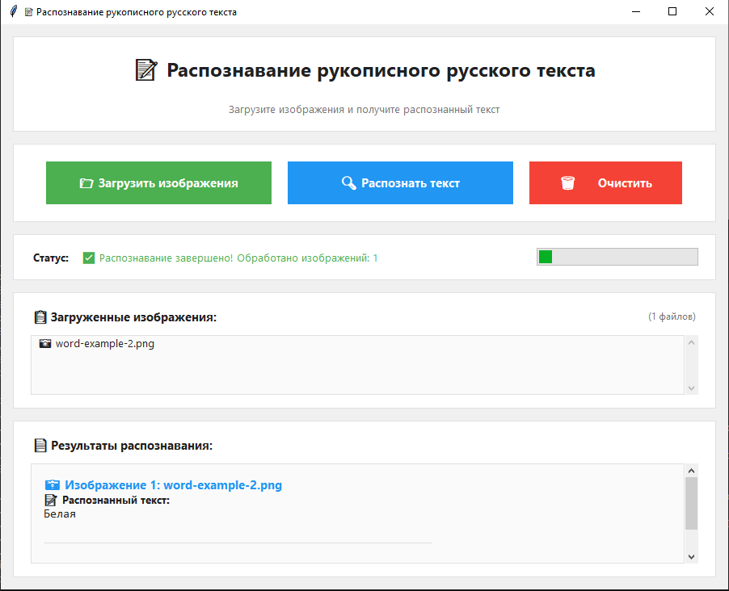

# Cyrillic (Russian) text recognition

Интерактивное десктоп-приложение на базе TensorFlow/Keras, которое распознаёт рукописные слова и фразы на русском языке. Графический интерфейс написан на `tkinter`: изображения можно добавлять через диалог, прогресс отображается в реальном времени, итоговые тексты выводятся прямо в окне.



## Возможности
- загрузка одной или нескольких картинок (PNG/JPG/JPEG/BMP/GIF);
- предпросмотр списка выбранных файлов и их количества;
- асинхронная загрузка модели и распознавание без подвисаний UI;
- детальный статус с прогресс-баром и цветовым кодированием;
- форматированный вывод результатов с именами файлов;
- кнопка очистки для быстрого сброса состояния.

## Требования
- Python 3.9+ (проект тестировался на Windows 10);
- `tkinter` (идёт в комплекте с большинством дистрибутивов Python);
- зависимости из `requirements.txt`:
  - `tensorflow>=2.5.0`
  - `numpy>=1.21.0`
  - `pandas`
  - `scikit-learn`

## Установка
```bash
git clone https://github.com/<username>/software-russian-handwritten-text.git
cd software-russian-handwritten-text
python -m venv venv
venv\Scripts\activate        # Windows
python -m pip install --upgrade pip
pip install -r requirements.txt
```

## Подготовка модели
1. Скачайте файл весов `model.h5`.
2. Поместите его в корень проекта рядом с `predict.py`.
3. При необходимости измените путь в `load_model_weights(...)`.

## Запуск
```bash
python predict.py
```
> Если вы запускаете на CPU, предупреждение `cudart64_110.dll not found` можно игнорировать — TensorFlow просто переключится на процессор.

## Работа с приложением
1. Нажмите **«📁 Загрузить изображения»** и выберите файлы (доступен мультивыбор).
2. Дождитесь сообщения «✅ Модель загружена успешно!».
3. Нажмите **«🔍 Распознать текст»** — распознавание идёт в фоновом потоке, статус обновляется автоматически.
4. Результаты появятся в нижнем блоке: для каждого изображения выводится имя файла и распознанная строка.
5. При необходимости нажмите **«🗑️ Очистить»**, чтобы сбросить список и очистить вывод.

## Архитектура модели
- Экстрактор признаков: VGG16 (слои `block1` и `block2`, без верхушки).
- Пост-обработка: сверточный слой + `BatchNorm`.
- Рекуррентная часть: два BiLSTM-слоя (256 и 128 нейронов).
- Классификатор: полносвязный слой на 151 класс с softmax.
- Функция потерь: CTC (`CTCLayer`).
- Метрики обучения: CER 0.0194, CTC loss 1.6510 (на валидации).

## Датасет
Модель обучена на наборе данных Национальной технологической олимпиады по ИИ и хакатона по OCR, организованного Академией искусственного интеллекта. Датасет содержит рукописные слова и символы кириллицы/латиницы, цифры и спецсимволы.

## Поддерживаемые символы
`!, ", %, (, ), *, +, ,, -, ., /, 0-9, :, ;, <, =, >, ?, A-Z, [, ], _, a-z, |, }, Ё, А-Я, а-я, ъ, ы, ь, э, ю, я, ё, №`  
(см. список `vocab_list` в `predict.py` для полного перечня).

## Текущее состояние репозитория
- `predict.py` — основной GUI и код модели.
- `model.h5` — веса модели (не входит в репозиторий, добавьте самостоятельно).
- `images/` — демонстрационные изображения.
- `train_model.ipynb` — эксперименты по обучению.

PR и issues приветствуются 🤝
